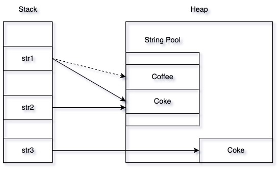

Java에서 String은 불변(Immutable) 객체로 정의된다. 불변 객체란 객체가 생성된 후 상태가 변하지 않고 계속 유지되는 객체를 말한다. String 인스턴스는 한 번 생성되면 그 값을 읽기만 할 수 있고, 변경할 수는 없다.

```java
String str1 = "Coffee"; // String Literal
str1 = "Coke"; 
String str2 = "Coke"; // String Literal
String str3 = new String("Coke"); // String Object
```



위 예시에서 `str1`과 `str2`는, `"Coke"`라는 value를 갖는 String Pool 내부의 하나의 String 객체를 바라보고 있다. 이 때 str1의 값을 `"Coffee"`로 바꾼다면 `str1`은 String Pool 내부의 다른 String 객체를 바라보게 된다.

<br/>

Java의 String은 불변성(immutability) 이라는 특성이 있어서 JVM은 String 객체에 대한 메모리 할당을 최적화 할 수 있다. 메모리 내부에 String pool 이라는 공간을 만들어 두고 고유한 리터럴 문자열을 저장하여 이를 참조하여 사용하도록 하는 방법을 사용해서 말이다. 이 과정을 **String Interning** 이라고 한다. 기본적으로 String 변수를 생성하고 문자열을 할당 (리터럴) 하게 되면 JVM 내부에서는 문자열 값이 String Pool 에 존재하는지 확인한다. 이때 발견이 된다면 Java 컴파일러는 해당 문자열 리터럴의 주소에 대한 참조를 반환하고 찾지 못한다면 해당 문자열의 리터럴을 Pool에 저장한 후에 참조를 반환한다.

<br/>

왜 String은 불변성을 가지게 설계되었을까. Java에서 String을 불변으로 만든 이유로는 크게 3가지가 있다.

1. 메모리 최적화
2. 성능 최적화 (해시코드 캐싱)
3. Thread Safe

<br/><br/>

### 메모리 할당 최적화

String은 가장 많이 사용되는 데이터 타입 중 하나이다. 그렇다는 것은 Java 어플리케이션에서 String 타입의 객체들이 가장 많은 메모리를 차지한다는 말이다. Java 언어를 설계할 당시 문자열 객체는 재사용 될 가능성이 높기때문에 **같은 값일 경우** 어플리케이션당 하나의 String 객체만을 생성해두어 JVM의 힙(heap)을 절약하고자 했던 것이다.

<br/><br/>

### 성능 최적화 (해시코드 캐싱)

해시맵, 해시테이블, 해시셋 등과 같은 자료구조에서 해시 구현에 따라 작동할 때 `hashCode()` 메서드가 꽤 자주 호출된다. 앞서 설명한 자료구조들은 key의 hash를 통해 value를 저장하는 구조를 가지고 있다. 따라서 매번 `hashCode()` 메서드를 호출하게 된다. 이 때, 매번 HashCode를 계산하게 된다면 성능에 영향을 줄 수 있다. 이런 부분을 고려하여 Java에서 String은 hash 값을 계산한 적이 없을 때 최초 1번만 실제 계산을 실행하고, 이 후 해당 값을 그냥 반환만 하도록 하여 재활용 할 수 있도록 설계되어 있다. 이런 설계가 가능한 이유는 String이 독립적이고 불변이기 때문이라고 할 수 있다.

<br/><br/>

### Thread Safe

객체가 불변이면 멀티 스레드 환경에서도 값이 바뀔 위험이 없기 때문에, 자연스럽게 Thread Safe한 특성을 갖게 되고, 동기화와 관련된 위험 요소에서 벗어날 수 있다. 여러 스레드에서 동시에 접근해도 별다른 문제가 없다.또한 String의 경우 한 스레드에서 값을 바꾸면, 해당 객체의 값을 수정하는 것이 아니라 새로운 객체를 String Pool에 생성한다. 따라서 Thread Safe하다고 볼 수 있다.

> String 클래스는 문자열 연산이 적고 조회가 많을 때 멀티스레드 환경에 적합하다.
> 

<br/><br/>

### **String이 불변이라 비효율적인점 (’+’연산자가 동작하는 방식)**

```java
String str1 = "Coffee";
String str2 = str1 + "And Donut";
```

Immutable이라 비효율적인 경우도 있다. String을 연결하는 concatenate 연산에서 immutable이기 때문에 문자열 A에 문자열 B를 더할 때 A에 B를 바로 덧붙이는 것이 아니라 새로운 문자열 객체를 C를 만들고 거기에 A와 B를 더한 결과를 담아야 한다. 다시 말해, `str2`는 `str1` 객체를 변경하는 것이 아니라, **새로운 객체를 생성한다**. String 객체는 **immutable**(변경 불가능)이므로 객체를 변경할 수 없으므로 새로운 객체를 생성한다. 이처럼 String 객체에 + 연산을 하면, 새로운 객체를 생성하고 또 소멸시키는 과정에서 비용이 발생한다. + 연산에 대해 버전에 따른 재정의가 존재하는데, 

> Java 1.5 이전에는 StringBuffer 의 append
> Java 1.5 이후에는 StringBuilder 의 append로 재정의하였으며
> Java 1.9 이후에는 [StringConcatFactory](https://docs.oracle.com/en/java/javase/11/docs/api/java.base/java/lang/invoke/StringConcatFactory.html) 를 통해 concat 연산 자체를 추상화하였다.

<br/><br/>

### 가변 객체인 StringBuffer, StringBuilder

이 두 클래스는 `AbstractStringBuilder`를 상속받으며 String과 달리 **mutable**(가변)의 성격을 갖고 있다. 즉, 기존의 문자열을 변경하고자 할 때 `append()` 메서드를 사용하여, 객체를 새롭게 생성하지 않고 기존의 문자열을 변경할 수 있다. String의 합연산(concat)은 AbstactStringBuilder를 구현한 인스턴스를 생성하여 `append()`를 호출시키기 때문에, **StringBuffer 와 StringBuilder의** `append()` **메서드보다 성능이 떨어진다.** StringBuilder, StringBuffer는 동기화를 지원하는지 아닌지에 따라서 특성이 구분된다.

> String은 불변, StringBuffer, StringBuilder는 가변이다. 
> StringBuffer, StringBuilder는 동기화 지원여부에 따라 구분된다.
 

**StringBuffer, StringBuilder 특징에 대해 조금 더 자세히 알아보자** 

<br/>

### StringBuffer는 동기화(Synchronized)를 지원한다

동기화란 스레드 A와 스레드B가 한 객체를 작업중일 때 A가 값을 바꿔버리면 B가 엉뚱한 값으로 작업을 시도할 수 있다. 여러 스레드가 한 자원을 사용하려고 할 때 다른 스레드의 접근을 막아 데이터 무결성을 보장해주는 것을 동기화라고 한다. 다른 스레드의 접근을 막는 동기화를 지원하니 여러 스레드(멀티 스레드)가 작업하기에 매우 안전한 환경이 만들어진다. 그래서 동기화를 지원한다는 말은 멀티스레드 환경을 지원한다는 말과 같다고 볼 수 있다.

<br/>

### StringBuilder는 non-Synchronized. 즉, 동기화를 지원하지 않는다.

동기화를 지원하지 않기 때문에 단일스레드 환경에서 사용해야 안전하다. 단일스레드 환경에서는 Buffer보다 속도가 빠르다.