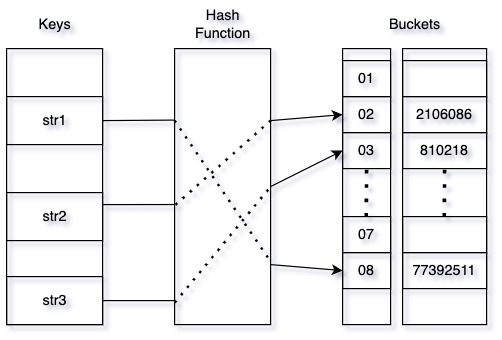

## 1. equals 메소드

String 문자열의 비교는 `==` 이나 `equals()` 두가지로 비교가 가능하다. Java 객체의 **동등성** 혹은 **동일성** 비교를 위한 연산이라고 할 수 있는데 자세히 알아보자.

```java
String str1 = "Coffee"; // String Literal1
str1 = "Coke"; 
String str2 = "Coke"; // String Literal2
String str3 = new String("Coke"); // String Object1
String str4 = new String("Coke"); // String Object2

System.out.println("Compare 1: " + str1.equals(str2)); // true or false
System.out.println("Compare 2: " + str2.equals(str3)); // true or false
System.out.println("Compare 3: " + str3.equals(str4)); // true or false

System.out.println("Compare 4: " + str1 == str2); // true or false
System.out.println("Compare 5: " + str2 == str3); // true or false
System.out.println("Compare 6: " + str3 == str4); // true or false

/*********
출력결과
Compare 1: true
Compare 2: true
Compare 3: true
Compare 4: true
Compare 5: false
Compare 6: false
*********/
```

기본적으로 `==` 연산은 참조형 변수일 경우 변수가 가리키는 메모리의 주소값을 비교하기 때문에 `str2` 와 `str3` 은 메모리에 할당된 주소가 달라 `false` 를 리턴하게 된다. 같은 이유로 `str3` 와 `str4` 또한 가리키는 객체가 다르기 때문에 `false` 이다.

String 클래스의 `equals()` 메소드는 내부적으로 어떻게 구현되어 있길래 변수가 서로 다른 객체를 가리키고 있음에도 `true`를 리턴할까. 그걸 확인하기에 앞서 Object 클래스의 `equals()` 메소드를 확인해보자. 아래와 같이 구현되어 있다.

```java

// Object.java
public boolean equals(Object obj) {
    return (this == obj);
}
```

Object 클래스의 `equals()` 메소드는 `==` 연산으로 **단순히 두 객체가 동일한 객체인지(물리적으로 같은 객체)를 비교**하고 있다. 하지만 String 클래스를 Object를 상속받은 클래스들은 실제로 객체속의 주소값을 일일히 비교하는 것이 아니라 **논리적**으로 동일한지를 파악하는 경우가 더 많을 것이다. 이런 경우 메소드 재정의(Override)를 통해 사용자 의도에 맞게 `equals()`를 재정의 한다.

<br/>

### equals 메소드 재정의의 예 (Student 클래스)

```java
public class Student {
    private String studentId;
    private String firstName;
    private String lastName;

    public Student(String studentId, String firstName, String lastName) {
        this.studentId = studentId;
        this.firstName = firstName;
        this.lastName = lastName;
    }

    @Override
    public boolean equals(Object obj) {
        if(obj == this) {
            return true;
        }

        if(obj == null | !(obj instanceof Student)) {
            return false;
        }

        Student stnt = (Student) obj;
        // 학번이 같으면 같은 학생.
        return this.studentId.equals(stnt.studentId);
    }
}
```

```java
Student student01 = new Student(1, "SunHong", "Lee");
Student student02 = new Student(2, "SunHong", "Lee");
Student student03 = student01;
System.out.println(student01.equals(student02)); // false
System.out.println(student01.equals(student03)); // true
```
무조건 생성된 객체의 주소값을 통해 비교하는 것이 아니라 Object 클래스의 `equals()` 메소드를 재정의함으로서 Student 클래스 객체의 Id(학번)이 동일하면 동일한 객체로 비교연산이 가능하도록 하였다.


<br/><br/>

## 2. hashCode 메소드

`hashCode()` 메소드는 어떤 객체를 대표하는 해시값을 32비트 정수로 리턴한다.

- `equals()`비교에 사용되는 정보가 변경되지 않았다면, 애플리케이션이 실행되는 동안 그 객체의 hashCode 메소드는 몇 번을 호출해도 일관되게 항상 같은 값을 리턴해야 한다. (단, 애플리케이션을 다시 실행한다면 이 값이 달라져도 상관없다.)
- `equals()`가 두 객체를 같다고 판단했다면, 두 객체의 hashCode는 똑같은 값을 리턴해야 한다.
- `equals()`가 두 객체를 다르다고 판단했더라도, 두 객체의 hashCode가 서로 다른 값을 리턴할 필요는 없다. 단, 다른 객체에 대해서는 다른 값을 리턴해야 해시테이블의 성능이 좋아진다. 같은값이 아닌 두 객체도 해시값이 같을 수 있다. (해시충돌)
- Object 클래스안에 기본 구현은 객체의 주소값을 리턴하는 것이다. Java에서 두 데이터가 동일하다는 의미는 `equals()`와 `hashCode()`가 모두 true인 결과를 나타낸다. 따라서 `equals()`와 같이 재정의가 필요하다.

> str1.equals(str2) == True 이면 hashCode(str1) == hashCode(st2) 이다.    
> 하지만 hashCode(str1) == hashCode(str2) 일때 str1.equals(str2) == True 는 반드시 참은 아니다. 



<br/>

### String 클래스에서 **hashCode() 작동 방식 이해**

Object 클래스의 `equals()` 메소드처럼 `hashCode()` 메소드 또한 **객체의 주소를 기반으로한 해시코드값을 리턴**하고 있다. 두 Java 객체의 **동일성**을 비교하기 위한 함수라고 할 수 있다.
 

간단히 말해 `hashCode()`는 해시 알고리즘에 의해 생성된 32비트 정수 값을 리턴한다. Java 8 기준 String 클래스의 `hashCode()` 함수 구현은 아래와 같다. 

```java
public int hashCode() {
        int h = hash;
        if (h == 0 && value.length > 0) {
            char val[] = value;

            for (int i = 0; i < value.length; i++) {
                h = 31 * h + val[i];
            }
            hash = h;
        }
        return h;
    }
```

1. 멤버변수 `hash`가 있으면 즉, hashCode 값을 계산한 적이 있다면 멤버변수 hash를 그대로 리턴한다.
2. String클래스의 멤버변수 `value[]`를 확인해보면 final로 선언되어있어서 immutable 이다. `value`가 한 번 대입되면 변하지 않기 때문에 hash 값이 변하지 않을 수 있다.
3. hashCode 값을 계산한 적이 없으면, 문자열을 앞에서부터 한 글자씩(char) 읽으면서 ASCII Code로 변환해서 처리를 합니다.
4. 기존까지 계산한 값은 31을 곱하고 새로운 문자는 ASCII Code의 숫자로 변환해서 숫자로 더한다.
5. 31을 곱해주는 이유는 퍼포먼스 측면에서 이점이 있기 때문이다. Effective Java에서는 31인 이유를 아래와 같이 설명한다.


> 💡 왜 31을 곱해주는가?    
> 31은 소수이면서 홀수이기 때문에 선택된 값이다. 만일 그 값이 짝수였고 곱셈 결과가 오버플로되었다면 정보는 사라졌을 것이다. 2로 곱하는 것은 비트를 왼쪽으로 shift하는 것과 같기 때문이다. 소수를 사용하는 이점은 그다지 분명하지 않지만 전통적으로 널리 사용된다. 31의 좋은 점은 곱셈을 시프트와 뺄셈의 조합으로 바꾸면 더 좋은 성능을 낼 수 있다는 것이다(31 * i는 (i << 5) - i 와 같다). 최신 VM은 이런 최적화를 자동으로 실행한다.


<br/>

### 정리: String 객체의 hashCode 값은 객체의 주소값이 아니다.

```java
String str1 = "Coffee"; // String Literal
str1 = "Coke";
String str2 = "Coke"; // String Literal
String str3 = new String("Coke"); // String Object1
String str4 = new String("Coke"); // String Object2

/* 
String 변수 4개에 대한 hashCode값 출력, 4개의 값은 같을까?
객체의 주소값을 가지는 값이라면 전부 일치하지는 않을 것이다.
*/
System.out.println("str1 hashCode(): " + str1.hashCode());
System.out.println("str2 hashCode(): " + str2.hashCode());
System.out.println("str3 hashCode(): " + str3.hashCode());
System.out.println("str4 hashCode(): " + str4.hashCode());
```

String 변수 4개에 대한 hashCode값을 출력한 결과는 아래와 같다.

```java
/*********
출력결과
str1 hashCode(): 2106086
str2 hashCode(): 2106086
str3 hashCode(): 2106086
str4 hashCode(): 2106086
*********/
```

String 클래스에서 `hashCode()` 메소드를 오버라이딩하여 재정의한 것의 의도처럼 동일한 문자열 값을 가진다면 리턴하는 hashCode값은 같다.

<br/>

### hashCode 메소드 재정의의 예 (Student 클래스)

Student 클래스에서 `equals()` 메소드를 재정의한것과 같이 `hashCode()` 메소드를 재정의해본다. 그전에 `hashCode()` 메소드를 재정의 하지 않았을때 **논리적으로 같은** 객체에 구분하지 못하는 문제를 먼저 확인해보자.

```java
public class Main {
    public static void main(String[] args) {
        // HashMap 선언, 학생과 학점을 key, value로 갖는다.
        Map<Student, String> m1 = new HashMap<>();

        // 객체를 생성한다. 학번: 10, 이름: Jennie Kim, 학점: A+
        m1.put(new Student("10", "Jennie", "Kim"), "A+");

        // 김제니 학생의 학점을 조회하기 위해 맵에서 get 함수를 이용해본다.
        System.out.println(m1.get(new Student("10", "Jennie", "Kim")));

        /*
        출력 결과는 A+일까?
        hashCode메소드를 재정의하지 않았기 때문에 null을 리턴한다.
        put에서 생성된 객체와 get에서 생성된 객체가 다르기 때문이다.
        */		
    }
}
```

출력결과는 주석에 덧붙인 것처럼 `null`을 리턴한다. 논리적으로 같다고 생각한 두 객체는 사실 물리적으로 다른 객체이므로 다른 hashCode를 가지기 때문이다. 이러한 문제를 해결하기 위해 Object 클래스의 `hashCode()` 메소드를 재정의하여 애플리케이션에서 두 객체가 사용자가 정의한 상황일때 논리적으로 같은 객체인 것으로 직접 정의한다. Student 클래스에서는 학번이 같으면 같은 학생으로 보고 두 객체를 동일하다고 판단한다고 가정해본다.

```java
    // 위에서 정의했던 Student 클래스에서 hashCode 메소드를 추가한다.
    @Override
    public int hashCode() {
        // 학번이 같으면 같은 학생.
        int h = Integer.parseInt(studentId);
        return h;
    }
```

위처럼 Student 클래스에 hashCode 메소드를 재정의하고 나면, hashCode값으로 논리적같은 두 객체를 판단할 수 있게되고 hashMap에서 정상적으로 원하는 객체의 값을 불러올 수 있게 된다.

<br/> <br/>
