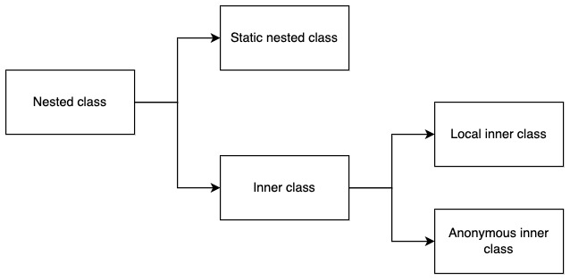

### Static nested class

- Nested 클래스는 static으로 선언되었는지에 따라 Static nested class와 Inner class로 나뉜다.
- Inner class는 이름이 있는지 없는지에 따라 Local inner class, Anonymous inner class로 나뉜다.



<br />

Nested class의 예시코드를 작성해보자

```java
// University 클래스 안에 Student라는 Nested class를 선언한다
public class University {
	static class Student {
		private int studentId = 0;

		public int getStudentId() {
			return studentId;
		}

		public void setStudentId(int studentId) {
			this.studentId = studentId;
		}
	}
}
```

<br />

Nested class인 Student 클래스는 객체를 생성하려면 어떻게 해야될까. 아래 코드를 보자

```java
public class NestedSample {
	public static void main(String[] args) {
		NestedSample sample = new NestedSample();
		sample.makeStaticNestedObject();
	}

	public void makeStaticNestedObject() {
		// nested class의 객체 생성
		University.Student student = new University.Student();
		student.getStudentId(100);
	}
}
```

<br />

Nested class를 왜 사용하는가?

- 한 곳에서만 사용되는 클래스를 묶어서 처리할 필요가 있을 때
    
    → 예를 들어 같은 Student 클래스라도 University 클래스의 Student 클래스가 있을 수 있고 HighSchool 클래스의 Student 클래스가 있을 수 있다. static nested class 를 선언해 줌으로서 클래스의 용도와 구분이 명확해진다.
    

<br />

### Inner class

Inner class는 static 선언부가 없는 내부클래스라고 하였다. 예시를 확인해보자 

```java
// University 클래스 안에 Student라는 Inner class를 선언한다
public class University {
	class Student {
		private int studentId = 0;

		public int getStudentId() {
			return studentId;
		}

		public void setStudentId(int studentId) {
			this.studentId = studentId;
		}
	}
}
```

<br />

Inner class인 Student 클래스는 객체를 생성하려면 어떻게 해야될까. 아래 코드를 보자

```java
public class InnerSample {
	public static void main(String[] args) {
		InnerSample sample = new InnerSample();
		sample.makeStaticInnerObject();
	}

	public void makeStaticInnerObject() {
		// inner class의 객체 생성
		University university = new University();
		University.Student student = university.new University.Student();
		student.getStudentId(100);
	}
}
```

<br />

Inner class는 Nested class와 다르게 static으로 선언되어 있지 않기 때문에 반드시 outer 클래스를 먼저 선언하고 내부에 있는 Inner class를 선언해줘야 한다. 

Inner class를 왜 사용하는가?

- 내부구현을 감추고 싶을 때. 즉, 캡슐화가 필요할 때 → 하나의 클래스에서 어떤 공통적인 작업을 수행하는 클래스가 필요한데 다른 클래스에서는 그 클래스가 전혀 필요가 없을 때 Inner class를 만들어 사용한다.