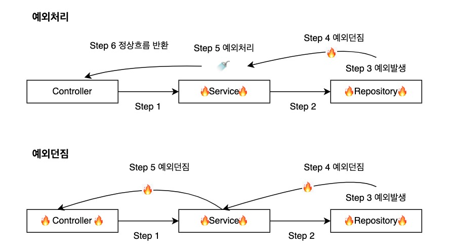
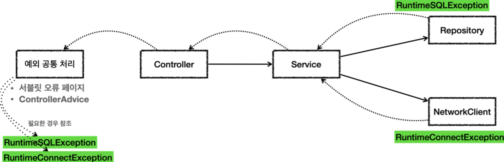

## 1) 예외처리 기본규칙

- 예외는 잡아서 `catch`하거나 `throw` 한다
- 예외를 잡거나 `throw` 할때 지정한 예외뿐 아니라 해당 예외의 자식도 함께 처리된다.
    - 예를들어 `Exception` 를 `catch` 로 잡으면 그 하위 예외도 모두 잡을 수 있다
    - 예들들어 `Exception` 를 `throws` 로 던지면 그 하위 예외도 모두 던질 수 있다.

<br/>

## 2) 예외가 발생했을때 진행순서

1. try블록의 실행이 중단된다.
2. catch 블록 중에 발생한 예외를 처리할 수 있는 블록이 있는지 찾는다.
3. 예외를 처리할 수 있는 catch 블록이 없다면 
    - finally 블록을 실행한 후 한 단계 높은 try 블록으로 전달한다.
4. 예외를 처리할 수 있는 catch 블록이 있다면 
    - 해당 catch 블록안의 코드 실행 → finally 블록 실행 → try 블록 이후의 코드 실행 순서로 이어진다.
    

<br/>

## 3) 다중 catch 블록 작성시 주의점

- 상위 예외 클래스가 하위 예외 클래스보다 먼저 나오면 안된다.

```java
// 상위 예외 클래스가 하위 예외 클래스보다 먼저 나오면 안된다
try {
	...
} catch (Exception e) {
	...
} catch (FileNotFoundException e) {
	...
} finally {

}

// 상위 예외 클래스는 나중에 catch 할 수 있도록 한다
try {
	...
} catch (FileNotFoundException e) {
	...
} catch (Exception e) {
	...
} finally {

}

// catch 문에 제일 상위 예외 클래스인 Exception을 제외하면 어떻게 될까

```
- 위에서 부터 차례대로 발생 예외에 따라 catch를 하면서 처리할 수 있도록 한다.
- 제일 상위 예외 클래스인 Exception을 제외하였는데 catch 할 수 없는 예외가 생긴다면 예외 발생하면서 프로그램이 종료된다.

<br/>

## 4) 체크 예외(Checked Exception)

체크 예외는 RuntimeException의 하위 클래스가 아니면서 Exception 클래스의 하위 클래스들이다. `체크 예외의 특징은 반드시 에러 처리를 해야하는 특징(try/catch or throw)`을 가지고 있다.

- `존재하지 않는 파일의 이름을 입력(FileNotFoundException)`
- `실수로 클래스의 이름을 잘못 적음(ClassNotFoundException)`

**체크** **예외 처리 & 던짐 흐름**



- **예외처리**는 5번 예외를 처리하게 되면 애플리케이션 로직이 정상흐름으로 마무리 된다.
- **예외던짐**은 예외를 처리하지 못할 경우로 호출된 곳으로 예외를 계속 던지는 모습이다.

<br/>

### 4-1) 체크 예외 throws 구문

```java
/* throws 구문구조: [메서드 선언부] throws [예외 클래스명] */
/* Exception을 상속받은 예외는 체크 예외가 된다. */
static class MyCheckedException extends Exception {
    public MyCheckedException(String message) {
        super(message);
    }
}

// 예시 repository, 체크예외기 때문에 throws가 있다
static class Repository {
    public void call() throws MyCheckedException {
        throw new MyCheckedException("ex");
    }
}
```

아래와 같은 메소드 선언부 옆에 반드시 추가해야된다. 추가하지 않으면 컴파일 오류발생.

- checked 예외를 던지는 메소드
- 다른 메소드에서 발생한 체크 예외를 처리하지 않는 메소드

<br/>

### 4-2) **체크 예외를 밖으로 던지는 코드**

```java
// 체크 예외를 밖으로 던지는 코드
public void callThrow() throws Exception {
    repository.call();
}
```

- throws에 `MyCheckedException` 의 상위 타입인 `Exception` 을 적어주어도 `MyCheckedException` 을 던질 수 있다.
- throws에 지정한 타입과 그 하위 타입 예외를 밖으로 던진다.
- 물론 정확하게 `MyCheckedException` 만 밖으로 던지고 싶다면 throws에 `MyCheckedException` 을 적어주어야 한다.

<br/>

### 4-3) **체크 예외를 잡아서 처리하는 코드**

```java
// 예외를 잡아서 처리하는 코드
public void callCatch() {
    try {
        repository.call();
    } catch (MyCheckedException e) {
        // 예외 처리 로직
        log.info("예외 처리, message={}", e.getMessage(), e);
    }
}
```

<br/>

## 5) 언체크 예외(Unchecked Exception)

언체크 예외는 `RuntimeException`의 하위 클래스들을 의미한다. 이것은 체크 예외와는 달리 에러 처리를 강제하지 않는다. 말 그대로 `실행 중에(runtime)` 발생할 수 있는 예외를 의미한다.

- `배열의 범위를 벗어난(ArrayIndexOutOfBoundsException)`
- `값이 null이 참조변수를 참조(NullPointerException)`

<br/>

### 5-1) 언체크 예외 throws 구문



```java
static class Repository {
    public void call() {
        try {
            runSQL();
        } catch (SQLException e) {
						// 체크예외를 catch하여 런타임 예외로 변경하여 throw한다
						// 기존 예외(e) 포함 - 반드시 포함해야한다 (중요)
            throw new RuntimeSQLException(e);
        }
    }

		// SQLException은 체크예외이다
    public void runSQL() throws SQLException {
        throw new SQLException("ex");
    }
}
```

```java
// RuntimeSQLException은 RuntimeException를 상속받는다 (언체크 예외)
static class RuntimeSQLException extends RuntimeException {
    public RuntimeSQLException() {
    }

    public RuntimeSQLException(Throwable cause) {
        super(cause);
    }
}
```

- `SQLException` 을 런타임 예외인 `RuntimeSQLException` 으로 변환했다.
- `ConnectException` 대신에 `RuntimeConnectException` 을 사용하도록 바꾸었다. 런타임 예외이기 때문에 서비스, 컨트롤러는 해당 예외들을 처리할 수 없다면 별도의 선언 없이 그냥 두면된다.

<br/>

## 6) 언제 체크예외를 적용하고 언제 언체크예외를 적용하는가

- 디폴트로 언체크(런타임) 예외를 사용한다.
- 그 외 비즈니스 로직상 중요한 부분을 `반드시 체크`해야 될때 체크 예외를 적용한다.

<br/>

## 7) **체크 예외의 문제점**

체크 예외는 컴파일러가 예외 누락을 체크해주기 때문에 개발자가 실수로 예외를 놓치는 것을 막아준다. 그래서 항상 명시적으로 예외를 잡아서 처리하거나, 처리할 수 없을 때는 예외를 던지도록 `method() throws Exception` 로 선언해야 한다. 문제는 2가지로 요약할 수 있다.

<br/>

### 7-1) 복구 불가능한 예외

`SQLException` 을 예를 들면 데이터베이스에 무언가 문제가 있어서 발생하는 예외이다. SQL 문법에 문제가 있을 수도 있고, 데이터베이스 자체에 뭔가 문제가 발생했을 수도 있다. 데이터베이스 서버가 중간에 다운 되었을 수도 있다. 이런 문제들은 서비스나 컨트롤러에서 이런 예외에 대한 복구가 불가능하다. 따라서 이런 문제들은 일관성 있게 공통으로 처리해야 한다. 오류 로그를 남기고 개발자가 해당 오류를 빠르게 인지하는 것이 필요하다.

<br/>

### 7-2) 의존 관계에 대한 문제

```java
// 컨트롤러는 SQLException를 명시함으로써 특정 예외에 의존하게 된다.
class Controller {
      public void request() throws SQLException, ConnectException {
          service.logic();
      }
}
```

`throws SQLException, ConnectException` 처럼 예외를 던지는 부분을 코드에 선언하는 것이 왜 문제가 되는가. 바로 서비스, 컨트롤러에서 java.sql.SQLException 을 의존하기 때문에 문제가 된다. 향후 리포지토리를 JDBC 기술이 아닌 다른 기술로 변경한다면, `SQLException` 에 의존하던 모든 서비스, 컨트롤러의 코드를 바뀌는 예외에 의존하도록 프로그램을 수정해야 한다. 서비스나 컨트롤러 입장에서는 어차피 본인이 처리할 수 도 없는 예외를 의존해야 하는 큰 단점이 발생하게 된다.

<br/>

### 7-3) 특정 예외가 아닌 최상위 예외인 Exception을 던진다면?

```java
void method() throws Exception {..}
```

이렇게 하면 `Exception` 은 물론이고 그 하위 타입인 `SQLException`, `ConnectException` 도 함께 던지게 된다. 코드가 깔끔해지는 것 같지만, `Exception` 은 최상위 타입이므로 모든 체크 예외를 다 밖으로 던지는 문제가 발생한다. 결과적으로 체크 예외의 최상위 타입인 `Exception` 을 던지게 되면 다른 체크 예외를 체크할 수 있는 기능이 무효화 되고, 중요한 체크 예외를 다 놓치게 된다. 중간에 중요한 체크 예외가 발생해도 컴파일러는 `Exception` 을 던지기 때문에 문법에 맞다고 판단해서 컴파일 오류가 발생하지 않는다. 이렇게 하면 모든 예외를 다 던지기 때문에 체크 예외를 의도한 대로 사용하는 것이 아니다. 결과적으로 어떤 예외를 잡고 어떤 예외를 던지는지 알 수 없기 때문이다. 따라서 꼭 필요한 경우가 아니면 이렇게 `Exception` 자체를 밖으로 던지는 것은 사용하지 말아야할 방법이다.

<br/>

### 체크 예외를 제외하고나서 생기는 런타임 예외의 **문제**
리포지토리에서 넘어오는 특정한 예외의 경우 복구를 시도할 수도 있다. 만약 특정 상황에는 예외를 잡아서 복구하고 싶으면 예외를 직접 구분해서 처리해야 한다.