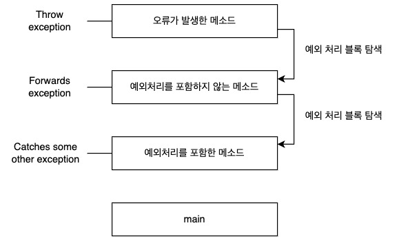
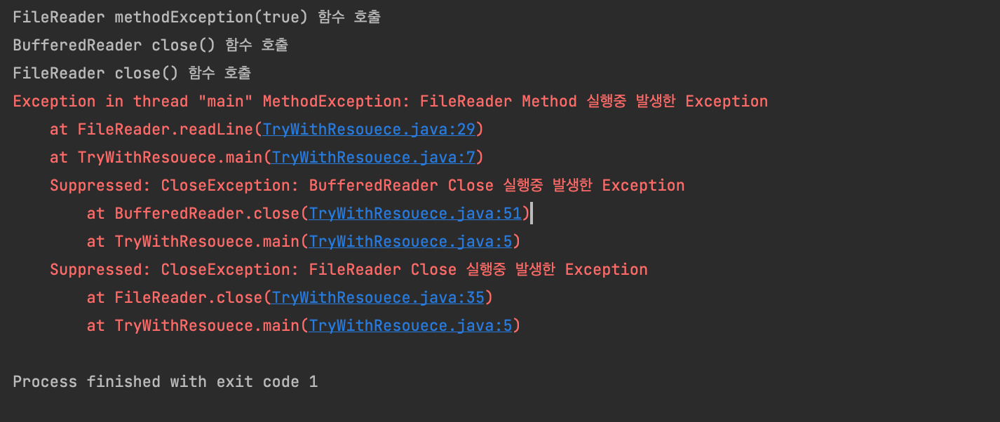
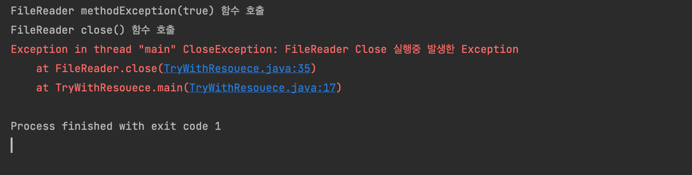

<br/>

[try-with-resource 예제코드](#example-try-with-resource)

<br/>

## What Is an Exception? (예외란 무엇인가)

**도대체 ‘예외’ 란 무엇인가?** 공식문서에서의 정의한 의미는 아래와 같다. 

> *예외(Exception)란 프로그램 실행 중에 발생하여 프로그램 명령의 정상적인 흐름을 방해하는 사건(event)이다.*
> 

메소드 내에서 오류가 발생하면 메소드는 `객체(Object)`를 만들고 런타임 시스템에 전달한다. 이 Obejct는 Exception Object를 말하며 오류가 발생했을 때 예외의 타입(type) 및 프로그램 상태를 포함하는 정보가 들어 있다. 이렇게 예외 객체(Exception object)를 생성하여 런타임 시스템에 전달하는 것을 ‘throwing an exception’(예외 던짐) 이라고 한다.

메소드가 예외를 throw한 후 런타임 시스템은 이를 처리할 무언가를 찾으려고 시도한다. 예외를 처리할 수 있는 "무언가" 집합은 오류가 발생한 메소드에 도달하기 위해 호출된 메소드의 정렬된 목록이다. 메소드 목록을 `call stack`이라고 한다.

런타임 시스템은 예외를 처리할 수 있는 코드 블록이 포함된 메소드에 대해 **call stack**을 검색한다. 이 코드 블록을 **exception handler**라고 한다. 탐색은 **오류가 발생한 메소드에서 시작**하여 메소드가 호출된 역순으로 **call stack**을 통해 진행된다. 적절한 핸들러가 발견되면 런타임 시스템은 예외를 핸들러에 전달한다. throw된 예외 객체(Exception object)의 타입이 핸들러가 처리할 수 있는 타입과 일치하는 경우 예외 핸들러가 적절한 것으로 간주된다.

선택된 예외 핸들러는 예외를 catch한다고 한다. 다음 그림과 같이 런타임 시스템이 적절한 예외 핸들러를 찾지 않고 **call stack**의 모든 메소드를 철저하게 탐색하면 런타임 시스템(및 결과적으로 프로그램)이 종료된다.



예외를 사용하여 오류를 관리하면 기존의 오류 관리 기술에 비해 몇 가지 이점이 있다.

<br/>

## The Catch or Specify Requirement (catch 하거나, throw 하거나)

유효(valid)한 Java 프로그래밍 언어 코드는 catch 또는 지정 요구사항을 준수해야 한다. 즉, 특정 예외를 throw할 수 있는 코드는 다음 두개 중 하나로 작성되어야 한다.

- 예외를 catch하는 try 구문을 작성할 것. try-catch는 예외에 대한 처리(handler)를 제공해야 한다.
- 예외를 throw할 수 있음을 지정할 것. 메소드는 메소드에서 throw된 예외 지정에 설명된 대로 예외를 나열하는 throws 절을 제공해야 한다.

catch 또는 지정 요구사항을 준수하지 않는 코드는 컴파일되지 않는다. 모든 예외가 catch 또는 지정 요구사항의 적용을 받는 것은 아니다. (언체크 예외가 그렇다.) 그 이유를 이해하려면 예외의 세 가지 기본 범주를 살펴볼 필요가 있다. 그 중 하나만 요구 사항이 적용된다.

<br/>

### ****Exception의 종류는 3가지로 구분된다.****

첫 번째 예외는 **체크 예외(Checked Exception)** 이다. 이는 잘 작성된 애플리케이션이 예상하고 복구해야 하는 예외적인 조건이다. 예를 들어 애플리케이션이 사용자에게 입력 파일 이름을 묻는 메시지를 표시한 다음 `java.io.FileReader`의 생성자에 이름을 전달하여 파일을 연다고 가정해보자. 일반적으로 사용자는 읽을 수 있는 존재하는 파일의 이름을 전달할 것이므로 FileReader는 성공적으로 객체를 만들고 응용 프로그램의 실행이 정상적으로 진행된다. 그러나 때때로 사용자는 존재하지 않는 파일의 이름을 전달하여 생성자는 `java.io.FileNotFoundException`을 던진다. 잘 작성된 프로그램은 이 예외를 포착하고 사용자에게 실수를 알리고 수정된 파일 이름을 묻는 메시지를 표시할 수 있다. 체크 예외는 위에서 설명했던 catch 또는 지정 요구사항의 적용을 받는다. `Error`, `RuntimeException` 및 해당 하위 클래스로 표시된 예외를 제외한 모든 예외는 체크 예외이다.

**체크 예외 예시**

- **FileNotFoundException**
- **ClassNotFoundException**
- **CloneNotSupportedException**

<br/>

두 번째 예외는 **Error**이다. 이는 애플리케이션 외부에 있으며 일반적으로 **애플리케이션이 예상하거나 복구할 수 없는 예외적인 조건**이다. 예를 들어 애플리케이션이 입력을 위해 파일을 성공적으로 열었지만 하드웨어 또는 시스템 오작동으로 인해 파일을 읽을 수 없다고 가정해보자. 읽기에 실패하면 `java.io.IOError`가 발생한다. 애플리케이션은 사용자에게 문제를 알리기 위해 이 예외를 catch하도록 할 수 있지만 프로그램이 스택 추적을 인쇄하고 종료하는 것도 유의미한 처리일 수도 있다. (어차피 처리가 불가능하기 때문에). **오류(Error)** 는 캐치 또는 지정 요구사항의 적용을 받지 않는다. 오류는 Error 및 해당 하위 클래스에 의해 표시되는 예외이다.

**오류(Error) 예시**

- **ThreadDeath**
- **OutOfMemoryError**
- **StackOverflowError**

<br/>

세 번째 종류의 예외는 **런타임 예외(runtime exception)** 이다. 이는 애플리케이션 내부에 있으며 일반적으로 애플리케이션이 예상하거나 복구할 수 없는 예외적인 조건이다. 이는 **일반적으로 논리 오류 또는 API의 부적절한 사용과 같은 프로그래밍 버그** 를 나타낸다. 예를 들어, FileReader의 생성자에 파일 이름을 전달하는 앞에서 설명한 애플리케이션을 가지고 생각해보자. 논리 오류로 인해 생성자에 null이 전달되면 생성자는 NullPointerException을 throw한다. 애플리케이션은 이 예외를 catch할 수 있지만 예외를 발생시킨 버그를 제거하는 것이 더 합리적인 처리방법 일 수 있다. 런타임 예외는 catch 또는 지정 요구사항의 적용을 받지 않는다. 런타임 예외는 RuntimeException 및 해당 하위 클래스에 의해 표시되는 예외이다. **오류(Error)** 와 **런타임 예외(Runtime Exception)** 를 통틀어 언체크 예외라고 한다.

**런타임 예외 예시**

- **NullPointerException**
- **IndexOutOfBoundsException**
- **IllegalArgumentException**

<br/>

## Catching and Handling Exceptions (예외 처리)

Exception handler 구성 요소인 **try-catch 및 finally** 블록을 사용하여 예외 핸들러를 작성하는 법을 알아보자. 그런 다음 Java SE 7에서 도입된 **try-with-resources 구문에 대해서도 살펴보자. `try-with-resources` 문은 `stream`과 같은 `Closeable` 리소스를 사용하는 상황에 특히 적합하다** . `ListOfNumbers`라는 클래스로 예를 들어보는데 `ListOfNumbers`는 생성될 때 0부터 9까지의 순차 값을 갖는 10개의 정수 요소를 포함하는 ArrayList를 만드는 클래스이다. `ListOfNumbers` 클래스는 OutFile.txt라는 텍스트 파일에 숫자 목록을 쓰는 writeList라는 메소드도 포함한다. 이 예제는 기본 I/O에서 다루는 java.io에 정의된 출력 클래스를 사용한다.

```java
// Note: 이 클래스는 아직 완전히 작성된 클래스가 아님.
import java.io.*;
import java.util.List;
import java.util.ArrayList;

public class ListOfNumbers {

    private List<Integer> list;
    private static final int SIZE = 10;

    public ListOfNumbers () {
        list = new ArrayList<Integer>(SIZE);
        for (int i = 0; i < SIZE; i++) {
            list.add(new Integer(i));
        }
    }

    public void writeList() {
				// FileWriter 생성자는 IOException을 던질 수 있다. 체크 예외
        PrintWriter out = new PrintWriter(new FileWriter("OutFile.txt"));

        for (int i = 0; i < SIZE; i++) {
						// get 메소드는 IndexOutOfBoundsException을 던질 수 있다. 언체크 예외.
            out.println("Value at: " + i + " = " + list.get(i));
        }
        out.close();
    }
}
```

<br/>

굵게 표시된 첫 번째 줄은 생성자에 대한 호출이다. 생성자는 파일의 출력 스트림을 초기화한다. 파일을 열 수 없는 경우 생성자는 `IOException`을 throw한다. 두 번째 굵게 표시된 줄은 ArrayList 클래스의 get 메소드에 대한 호출로, 인덱스의 범위를 벗어나는 경우`IndexOutOfBoundsException`을 throw한다. `ListOfNumbers` 클래스를 컴파일하려고 하면 컴파일러는 FileWriter 생성자가 throw한 예외에 대한 오류 메시지를 출력한다. 그러나 get에서 발생한 예외에 대한 오류 메시지는 표시하지 않는. 그 이유는 생성자에서 던진 예외인 `IOException`은 체크 예외이고 get 메소드에서 던진 `IndexOutOfBoundsException`은 언체크 예외이기 때문이다. 이제 ListOfNumbers 클래스와 이 클래스 내에서 예외가 throw될 수 있는 위치에 익숙해졌으므로 이러한 예외를 catch하고 처리하는 예외 핸들러를 작성할 준비가 되었다.

<br/>

### The try Block

예외 핸들러를 구성하는 첫 번째 단계는 try 블록 내에서 예외를 throw할 수 있는 코드를 try로 감싸는 것이다.

```java
try {
	// code
} catch and finally blocks..
```

`ListOfNumbers` 클래스에서 writeList 메소드에 대한 예외 핸들러를 생성하려면 writeList 메소드의 예외 발생 문을 try 블록으로 감싼다. 이 작업을 수행하는 방법은 여러 가지가 있다. 예외를 발생시킬 수 있는 코드의 각 줄을 자체 try 블록에 넣고 각각에 대해 별도의 예외 처리기를 제공할 수 있다. 또는 단일 try 블록 내에 모든 writeList 코드를 넣고 여러 핸들러를 연결할 수 있다. 다음 목록은 문제의 코드가 매우 짧기 때문에 전체 메소드에 대해 하나의 try 블록을 사용한다. try 블록 내에서 예외가 발생하면 해당 예외는 연결된 예외 핸들러에 의해 처리된다. 예외 핸들러를 try 블록과 연결하려면 그 뒤에 catch 블록을 넣어야 한다. 

```java
private List<Integer> list;
private static final int SIZE = 10;

public void writeList() {
    PrintWriter out = null;
    try {
        System.out.println("Entered try statement");
        FileWriter f = new FileWriter("OutFile.txt");
        out = new PrintWriter(f);
        for (int i = 0; i < SIZE; i++) {
            out.println("Value at: " + i + " = " + list.get(i));
        }
    } catch (IndexOutOfBoundsException e) {
	    System.err.println("IndexOutOfBoundsException: " + e.getMessage());
		} catch (IOException e) {
	    System.err.println("Caught IOException: " + e.getMessage());
		}
}
```

<br/>

### The catch Blocks

각 catch 블록은 해당 매개변수가 나타내는 예외 타입을 처리하는 예외 핸들러이다. 매개변수 타입인 ExceptionType은 핸들러가 처리할 수 있는 예외 타입을 선언하고 `Throwable` 클래스에서 상속되는 클래스의 이름이어야 한다. 핸들러는 이름으로 예외를 참조할 수 있다. catch 블록에는 예외 핸들러가 호출될 때 실행되는 코드가 포함된다. 런타임 시스템은 핸들러가 call stack에서 ExceptionType이 throw된 예외 타입과 일치하는 첫 번째 것일 때 예외 핸들러를 호출한다. throw 객체가 예외 해들러의 매개변수에 합법적으로 할당될 수 있는 경우 시스템은 이를 일치로 간주한다. 예외 핸들러는 오류 메시지를 인쇄하거나 프로그램을 중지하는 것 이상을 수행할 수 있다. 연결 예외 섹션에 설명된 대로 오류 복구를 수행하거나 사용자에게 결정을 내리도록 프롬프트를 표시하거나 연결 예외를 사용하여 상위 수준 처리기로 오류를 전파할 수 있다.

<br/>

### 하나의 예외 핸들러로 둘 이상의 예외 유형 잡기

Java SE 7 이상에서는 단일 catch 블록이 둘 이상의 예외 유형을 처리할 수 있다. 이 기능은 코드 중복을 줄이고 지나치게 광범위한 예외를 포착하려는 유혹을 줄일 수 있다.

catch 절에서 블록이 처리할 수 있는 예외 유형을 지정하고 각 예외 유형을 세로 막대(|)로 구분한다.

```java
catch (IOException|SQLException ex) {
		logger.log(ex);
		throw ex;
}
```

참고: catch 블록이 둘 이상의 예외 유형을 처리하는 경우 catch 매개변수는 암시적으로 `final`이다. 이 예에서 catch 매개변수 ex는 `final`므로 catch 블록 내에서 값을 할당할 수 없다.

<br/>

### The Finally Block

finally 블록은 try 블록이 종료될 때 항상 실행된다. 이렇게 하면 예기치 않은 예외가 발생하더라도 finally 블록은 실행된다. 그러나 finally는 단순히 예외 처리보다 더 유용한 측면이 있다. 예를 들자면 프로그래머가 실수로 return, continue 또는 break으로 인해 cleanup 코드를 패스하는 것을 방지할 수 있도록 처리할 수 있다. finally 블록에 cleanup 코드를 넣는 것은 예외가 예상되지 않는 경우에도 항상 좋은 방법이다.

> 참고: try 또는 catch 코드가 실행되는 동안 JVM이 종료되면 이런 상황에서는 finally 블록이 실행되지 않을 수 있다.
> 

예제코드에서 writeList 메소드의 try 블록은 `PrintWriter`를 호출한다. **주의할 점은 프로그램이 writeList 메소드를 종료하기 전에 해당 `stream`을 `close` 해야한다는 것이다.** 이것은 writeList의 try 블록이 세 가지 방법 중 하나로 종료될 수 있기 때문에 finally이 아니라면 다소 복잡하게 고려해야 한다.

1. `new FileWriter()` 생성자 호출 구문이 실패하고 `IOException`이 발생한다.
2. `list.get(i)` 호출 구문이 실패하고 `IndexOutOfBoundsException`이 발생한다.
3. 모든 것이 성공하고 try 블록이 정상적으로 종료된다.

런타임 시스템은 try 블록 내에서 일어나는 일에 관계없이 항상 finally 블록 내에서 명령문을 실행한다. 따라서 cleanup을 수행하기에 완벽한 장소이다. writeList 메소드에 대한 다음 finally 블록은 PrintWriter 및 FileWriter를 정리한 다음 닫는다.

```java
finally {
	if (out != null) {
        System.out.println("PrintWriter 종료");
        out.close();
	} else {
        System.out.println("PrintWriter가 열리지 않았습니다.");
	}
	if (f != null) {
        System.out.println("FileWriter 닫기");
        f.close();
	}
}

```

> 중요: 파일을 닫거나 리소스를 복구할 때 finally 블록 대신 **try-with-resources** 문을 사용하라. 다음 예제에서는 try-with-resources 문을 사용하여 writeList 메소드에 대한 PrintWriter 및 FileWriter를 정리하고 닫는 것을 확인해보자.
> 

<br/>

### ****The try-with-resources statement****

`try-with-resources` 문은 하나 이상의 리소스를 선언하는 try 구문이다. 리소스는 프로그램이 끝난 후 닫아야 하는 객체를 말한다. `try-with-resources`문은 각 리소스가 구문의 끝에서 닫히도록 한다.  `java.lang.AutoCloseable` 를 포함해서 `java.io.Closeable` 를 `implements` 하는 모든 객체를 **resource**로 사용할 수 있다. 다음 예제에서는 파일에서 첫 번째 줄을 읽는다. `FileReader` 및 `BufferedReader`의 인스턴스를 사용하여 파일에서 데이터를 읽는다. `FileReader` 및 `BufferedReader`는 프로그램이 끝난 후 닫아야 하는 리소스이다.

```java
// The try-with-resources 구문 예제
static String readFirstLineFromFile(String path) throws IOException {
	    try (FileReader fr = new FileReader(path);
	         BufferedReader br = new BufferedReader(fr)) {
	        return br.readLine();
	    }
	}
```

위 예에서 `try-with-resources`문에 선언된 리소스는 `FileReader` 및 `BufferedReader`이다. 이러한 리소스의 선언문은 try 키워드 바로 뒤에 괄호 안에 나타난다. Java SE 7 이상에서 `FileReader` 및 `BufferedReader` 클래스는 `java.lang.AutoCloseable` 인터페이스를 구현한 클래스이다. `FileReader` 및 `BufferedReader` 객체는 `AutoCloseable` 을 구현한 객체이면서 `try-with-resource` 에서 선언되기 때문에 try 문이 정상적으로 완료되거나 갑자기 완료되는지 여부에 관계없이 닫힌다 (BufferedReader.readLine 메소드가 IOException을 발생시킨 결과). Java SE 7 이전에는 finally 블록을 사용하여 try 문이 정상적으로 완료되었는지 갑자기 완료되었는지 여부에 관계없이 리소스를 close 선언을 통해 닫아야 했다. 아래 코드는 try-with-resources 문 대신 finally 블록을 사용하는 예제이다.

```java
// The try-with-resources 구문 대신 finally를 사용한 예제
static String readFirstLineFromFileWithFinallyBlock(String path) throws IOException {
   
    FileReader fr = new FileReader(path);
    BufferedReader br = new BufferedReader(fr);
    try {
        return br.readLine();
    } finally {
        br.close();
        fr.close();
    }
}
```

이 예제에서 리소스 누수가 발생할 수 있다. 프로그램은 리소스 사용이 끝났을 때 리소스의 메모리를 회수하기 위해 가비지 컬렉터(GC)에 의존하는 것 이상을 수행해야 한다. 또한 프로그램은 일반적으로 리소스의 close 메소드를 호출하여 리소스를 운영체제로 다시 해제(release)해야 한다. 그러나 GC가 리소스를 회수하기 전에 프로그램이 이 작업을 수행하지 못하면 리소스를 해제하는 데 필요한 정보가 손실(lost)된다. 운영체제에서 여전히 사용 중인 것으로 간주되며 리소스 누수가 발생한 것이다. 위 예제코드에서 readLine 메소드가 예외를 throw하고 finally 블록의 `br.close()`문에서 예외가 발생하면 FileReader가 누수된 것이다. 따라서 이런 일이 발생하지 않으면서 프로그램의 리소스를 완전히 닫으려면 finally 블록 대신 `try-with-resources` 문을 사용하여야 한다. readLine 메소드와 close 메소드가 모두 예외를 throw하는 경우 `readFirstLineFromFileWithFinallyBlock` **메소드는 finally 블록에서 throw된 예외를 throw한다.** try 블록에서 throw된 예외가 억제(suppressed)된다. 반대로, `readFirstLineFromFile` 예제에서 try 블록과 `try-with-resources` 문 모두에서 예외가 발생하면 `readFirstLineFromFile` 메소드는 **try 블록에서** 예외가 발생한다. `try-with-resources` 블록에서 발생한 예외는 억제된다.

<br/>
<br/>

### Example try with resource

<br/>

**try-with-resource 예제**

try-with-resource 문을 통해서 따로 `close()`를 호출하지 않아도 try을 수행을 마치면서 동시에 자동으로 두 `br.close()` ,`br.close()`함수 모두 호출한다. 또한 로그에서 억제된 (Suppressed)된 예외까지 전부 확인할 수 있다. 이때 클래스는 AutoClosebale을 구현해야 한다.

```java
class TryWithResouece {
    public static void main(String[] args) throws Exception {
        // try-with-resource
        try (FileReader fr = new FileReader();
              BufferedReader br = new BufferedReader())  {
            fr.readLine(true);
        }
    }
}

class FileReader implements AutoCloseable {

    public void readLine(boolean exception) throws MethodException {
        System.out.println("FileReader methodException(" + exception + ") 함수 호출");
        if(exception) {
            throw new MethodException("FileReader Method 실행중 발생한 Exception");
        }
    }

    public void close() throws Exception {
        System.out.println("FileReader close() 함수 호출");
        throw new CloseException("FileReader Close 실행중 발생한 Exception");

    }
}

class BufferedReader implements AutoCloseable {

    public void readLine(boolean exception) throws MethodException {
        System.out.println("BufferedReader methodException(" + exception + ") 함수 호출");
        if(exception) {
            throw new MethodException("BufferedReader Method 실행중 발생한 Exception");
        }
    }

    public void close() throws Exception {
        System.out.println("BufferedReader close() 함수 호출");
        throw new CloseException("BufferedReader Close 실행중 발생한 Exception");

    }
}

class MethodException extends Exception {
    MethodException(String msg) { super(msg); }
}

class CloseException extends Exception {
    CloseException(String msg) { super(msg); }
}
```




<br/>

**try-finally 예제**

try-with-resource 문과는 달리 `br.close()` 함수는 호출되지 않았다. 메모리 누수가 발생할 여지가 있다. 또한 로그에서 예외 부분을 단 한가지만 확인할 수 있다.

```java
class TryWithResouece {
    public static void main(String[] args) throws Exception {
        // try-finally 
        FileReader fr = new FileReader();
        BufferedReader br = new BufferedReader();
        try {
            fr.readLine(true);
        } finally {
            fr.close();
            br.close();
        }
     
    }
}

class FileReader implements AutoCloseable {

    public void readLine(boolean exception) throws MethodException {
        System.out.println("FileReader methodException(" + exception + ") 함수 호출");
        if(exception) {
            throw new MethodException("FileReader Method 실행중 발생한 Exception");
        }
    }

    public void close() throws Exception {
        System.out.println("FileReader close() 함수 호출");
        throw new CloseException("FileReader Close 실행중 발생한 Exception");

    }
}

class BufferedReader implements AutoCloseable {

    public void readLine(boolean exception) throws MethodException {
        System.out.println("BufferedReader methodException(" + exception + ") 함수 호출");
        if(exception) {
            throw new MethodException("BufferedReader Method 실행중 발생한 Exception");
        }
    }

    public void close() throws Exception {
        System.out.println("BufferedReader close() 함수 호출");
        throw new CloseException("BufferedReader Close 실행중 발생한 Exception");

    }
}

class MethodException extends Exception {
    MethodException(String msg) { super(msg); }
}

class CloseException extends Exception {
    CloseException(String msg) { super(msg); }
}
```




### Reference
[[Oracle Java Docs] Exceptions](https://docs.oracle.com/javase/tutorial/essential/exceptions/definition.html)


