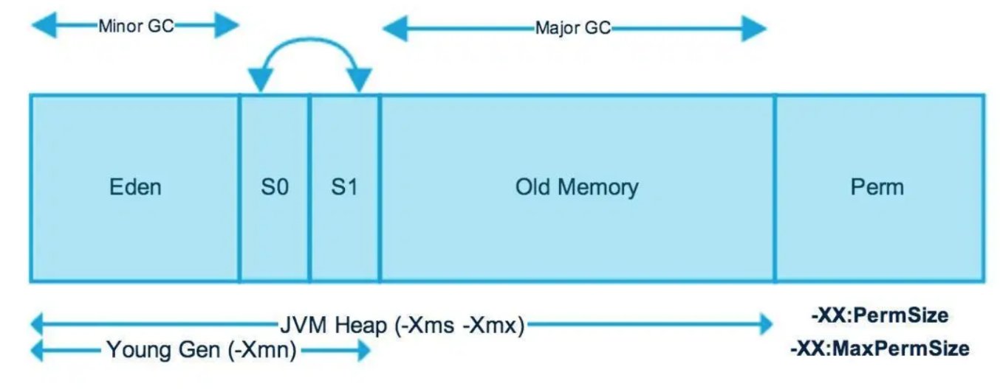
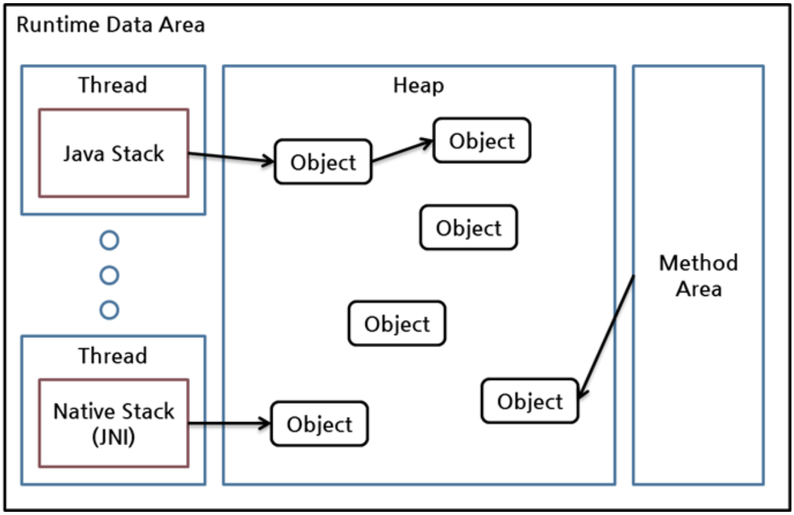

JVM Heap 영역에서 사용하지 않는 객체(Object)를 삭제하는 프로세스를 말한다.

 

Java의 가비지 컬렉터(Garbage Collector)는 그 동작 방식에 따라 매우 다양한 종류가 있지만 공통적으로 크게 다음 2가지 작업을 수행한다고 볼 수 있다.

1. **힙(heap) 내의 객체 중에서 가비지(garbage)를 찾아낸다. (mark)**
2. **찾아낸 가비지를 처리해서 힙의 메모리를 회수한다. (sweep)**

- Heap Area는 Eden, Survivor1, Survivor2, Old Generation으로 구분된다.
- Eden, Survivor1, 2를 합쳐서 Young Generation이라고 칭한다.
- Young Generation에서 발생하는 GC를 Minor GC, Old Generation에서 발생하는 GC를 Major GC라고 하며 Minor GC보다 속도가 느리다.

### Garbage Collector Object가 삭제할 대상인지 아닌지 어떻게 아는가?

가비지 컬렉터에는 GC Root라는 것이 있다. GC Root들은 힙 외부에서 접근할 수 있는 변수나 오브젝트를 뜻한다. GC Root는 말그대로 가비지 컬렉션의 Root라는 뜻이다. 이 Root로 부터 어떤 객체에 유효한 참조가 있으면 'reachable'로, 없으면 'unreachable'로 구별하고, unreachable 객체를 가비지로 간주해 GC를 수행한다.

힙에 있는 객체들에 대한 참조는 다음 4가지 종류 중 하나이다.

- 힙 내의 다른 객체에 의한 참조
- **Java 스택, 즉 Java 메소드 실행 시에 사용하는 지역 변수(local)와 파라미터들에 의한 참조**
- **메소드 영역의 정적 변수(static)에 의한 참조**
- **네이티브 스택, 즉 JNI(Java Native Interface)에 의해 생성된 객체에 대한 참조**

이들 중 힙 내의 다른 객체에 의한 참조를 제외한 나머지 3개가 GC root set으로, reachability를 판가름하는 기준이 된다.

 

### **GC 동작 Flow**

1. 객체가 생성이 되면 Eden 영역에 생성된다.
2. Eden 영역이 차게 되면 Minor GC가 발생하고 Mark and Sweep과 aging을 거쳐 살아남은 객체를 Survivor1 또는 Survivor2 영역으로 이동시킨다.
    - Survivor 영역을 거치지 않고 바로 Old Genration으로 이동하는 경우가 있는데, 객체의 크기가 Survivor 영역의 크기보다 클 경우이다.
    - Survivor1과 Survivor2 영역은 둘 중 한 곳에만 객체가 존재하며, 다른 한 곳은 항상 비어져 있다.
    - 보통 From, to 로 구분을 하는데, 객체가 존재하는 Survivor영역(From)이 가득 차면 다른 Survivor영역(To)으로 보내게되고, 기존의 Survivor영역(From)을 비우는 작업을 진행한다.
3. 위 과정(1~2)을 반복하면서 Survivor 영역에서 계속 살아남는 객체들의 age값이 MaxTenuringThreshold 기준을 넘어가게 되면 Old Generation 영역으로 이동하게 된다.
4. Old Generation 영역에서 살아남았던 객체들이 일정 수준 쌓이게 되면 미사용된다고 식별된 객체들을 제거해주는 Full GC가 발생한다.
    - 이 과정에서 STW(Stop-The-World)가 발생한다.

 

### Reference
[참고: Tistory 가비지 컬렉터(Garbage Collector)와 Mark & Sweep](https://imasoftwareengineer.tistory.com/103)      
[참고: Naver D2 Java Reference와 GC](https://d2.naver.com/helloworld/329631)        
[참고: velog [JAVA] GC(Garbage Collector)](https://velog.io/@cham/JAVA-GCGarbage-Collector)