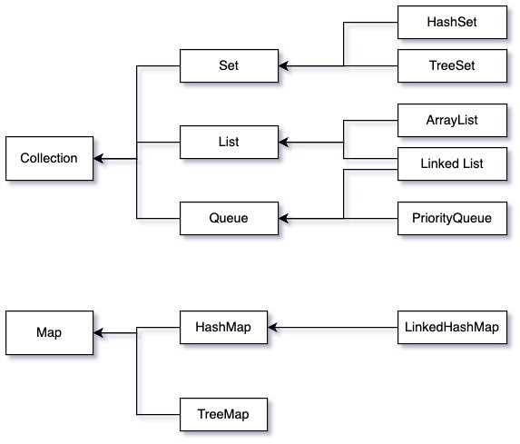

## List

<br/>

### ArrayList

ArrayList의 상속관계는 아래와 같다.

```java
java.lang.Object
	java.util.AbstractCollection<E>
		java.util.AbstractList<E>
			javaj.util.ArrayList<E>
```

`ArrayList` 정의된 부분을 보면 다음과 같이 되어있다.

```java
public class ArrayList<E> extends AbstractList<E>
        implements List<E>, RandomAccess, Cloneable, java.io.Serializable {
				...
```

[참고: 우아한형제들 기술블로그 자바 직렬화, 그것이 알고싶다](https://techblog.woowahan.com/2550/)

- `Serializable`: 생성한 객체를 JSON로 저장하여 API로 데이터를 전달할 수 있음을 지정
- `Cloneable`: Object 클래스의 clone 메소드로 객체의 복제가 가능함을 명시
- `RandomAccess`: 목록형 데이터에 액세스할 때 우수한 성능을 제공하도록 동작을 변경할 수 있도록 하는 것
- `List`: 목록형 데이터를 처리하는것과 관련된 메소드 지정

- **단반향 포인터 구조로 데이터 순차적 접근에 강점을 가진다**
- **배열을 기반으로 데이터를 저장한다**
- **데이터 삽입, 삭제가 느리다**
- **데이터 검색이 빠르다**
- **Thread Safe 하지 않음**

ArrayList는 List 컬렉션 인터페이스를 구현한 클래스이다. List 컬렉션처럼 인덱스로 객체를 관리한다.일반 배열과 ArrayList는 인덱스로 객체를 관리한다는 점에서 동일하지만, 크기를 동적으로 늘릴 수 있다는 점에서 차이점이 있다. 배열은 처음 생성할 때 고정 크기를 지정하며, 사용 중에 크기를 변경할 수 없다. 만약 크기를 늘려야 한다면 새로 배열을 선언해야 한다는 단점이 있다. 

<br/>

### Vector

- **ArrayList의 구형버전이며, 모든 메소드가 동기화 되어있음**
- **잘 쓰이진 않음**
- **Thread Safe**

Vector는 ArrayList와 동일한 내부 구조를 가지고 있다. Vector 객체를 생성하기 위해서는 저장할 타입을 지정해야 한다. ArrayList와 차이점으로는 Vector 클래스는 동기화된(synchronized) 메서드로 구성되어 있다. 그렇기 때문에 멀티 스레드 환경에서 안전하게 객체를 추가, 삭제할 수 있다. 즉, 스레드에 안전하다(Thread Safe)라고 말합니다. 다만 동기화되어 있기 때문에 ArrayList 보다는 객체를 추가, 삭제하는 과정은 느릴수 밖에 없다. 안전성을 추구하는데 있어서 속도를 포기한 트레이드 오프(trade off)이다.

<br/>

### LinkedList

```java
public class LinkedList<E>
    extends AbstractSequentialList<E>
    implements List<E>, Deque<E>, Cloneable, java.io.Serializable
{
...
```

- **양방향 포인터 구조로 데이터 삽입, 삭제가 빠르다. (ArrayList과 다른 점)**
- ArrayList보다 검색이 느리다
- LinkedList는 List도되고 Queue의 기능을 모두 구현하였다.

LinkedList는 List 구현 클래스이다. 내부 구조는 ArrayList와 다르다 .ArrayList에는 내부 배열에 객체를 저장해서 인덱스로 관리하지만, LinkedList는 인접 참조를 링크해서 체인처럼 관리한다. 그렇기 때문에LinkedList에서 특정 인덱스의 객체를 제거하게 되면, 제거되는 인덱스의 앞 뒤 링크만 변경되고 나머지 링크는 변경되지 않는다.

<br/>
<br/>

## Set

Set은 순서에 상관없이 어떤 데이터가 존재하는지 확인하기 위한 용도로 많이 사용된다. 다시 말해서 중복되는 것을 방지하고, 원하는 값이 포함되어 있는지를 확인하는 것이 주 용도다. 예를 들어 어떤 서버에 1분간 요청한 로그가 있다. 이 서버에 붙어서 **요청한 IP를 기준으로 사용자의 수가 얼마나 되는지 확인한다고 가정**해보자. 1분간 동일한 서버에 요청하는 중복 사용자 수는 매우 많다. 만약에 `List` 로 확인하려고 한다면 `indexOf()` 로 해당 사용자가 요청한 내역이 있는지 먼저 확인 후 없으면 add 메소드로 추가하는 방식으로 해야될 것이다. `Set` 을 사용하게 되면 이런 반복적인 작업을 피하고 데이터를 그냥 추가해주는 것만으로 원하는 작업의 구현이 가능하다. 어떤 값이 존재하는지 없는지 여부만 중요할 때 Set을 사용하면 된다.

<br/>

### HashSet

**HashSet의 상속관계**

```java
java.lang.Object
	java.util.AbstractCollection<E>
		java.util.AbstractSet<E>
			javaj.util.HashSet<E>
```

- 정렬없이 순서가 전혀 필요없는 데이터를 해시 테이블에 저장한다. Set 중에 가장 성능이 좋다.

<br/>

### TreeSet

- **저장된 데이터의 값이 따라 정렬**되는 셋이다. red-black이라는 트리 타입으로 값이 저장되며 HashSet보다는 성능이 느리다.

<br/>
<br/>

## Map

- 모든 데이터는 `key`, `value`가 존재한다.
- `key`는 해당 `Map`에서 고유해야 한다.
- `value` 는 중복되어도 괜찮다.
- 데이터간의 순서는 없다.

<br/>

### HashMap 과 Hashtable의 비교

[참고: github Java HashMap은 어떻게 동작하는가?](https://github.com/wjdrbs96/Today-I-Learn/blob/master/Java/Collection/Map/Java)

- Java에 Collection이라는 인터페이스가 추가된 것은 `JDK 1.2`, HashMap과 TreeMap도 이때 추가되었다.
- `Hashtable`은 `JDK 1.0` 버전부터 있었던 클래스이다.
- `Hashtable`은 **Thread-safe**하고, `HashMap`은 **Thread-unsafe** 라는 특징을 가지고 있다.
- `Hashtable`은 key에 **null을 허용하지 않지만**, `HashMap`은 **key에 null을 허용**한다.
- `HashMap`은 보조해시를 사용하기 때문에 보조 해시함수를 사용하지 않는 `Hashtable`에 비하여 해시충돌(hash collision)이 덜 발생할 수 있어 상대적으로 성능상 이점이 있다.
- Hashtable의 구현부
    
    ```java
    public class Hashtable<K,V>
        extends Dictionary<K,V>
        implements Map<K,V>, Cloneable, java.io.Serializable {
    ```
    
- HashMap의 구현부
    
    ```java
    public class HashMap<K,V> extends AbstractMap<K,V>
        implements Map<K,V>, Cloneable, Serializable {
    ```
    
<br/>

### HashMap

- `HashMap`의 key는 기본 자료형과 참조형 모두 될 수 있다. 그래서 보통 int, String 같은 걸 쓰기도 하는데, 개발자가 직접 클래스를 만들어 그 클래스를 key로 사용한다면 `Object` 클래스의 `hashCode()`, `equals()` 를 잘 구현해놓아야 한다.
- 정렬된 key목록의 Map을 원한다면  `TreeMap` 을 활용하자.