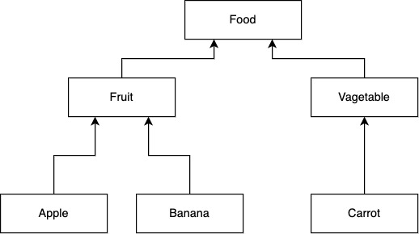
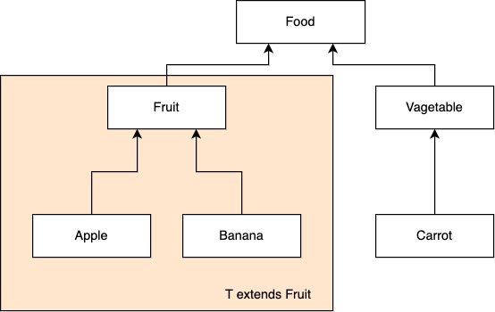
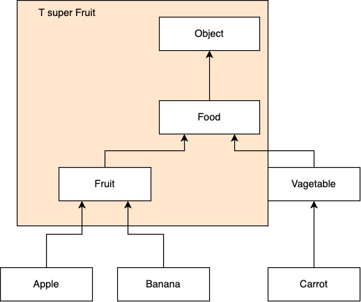

<br/>

### 이유 1) 타입 안정성 / 타입 캐스팅 제거

아래와 같이 과일을 담는 `FruitBox`라는 클래스를 정의해보자

```java
class FruitBox {
	private Object fruit;
	
	public FruitBox(Object fruit) {
		this.fruit = fruit;		
	}
		
	public Object getFruit() {
		return fruit;
	}
}
 
```

```java
public static void main(String[] args) {
	FruitBox appleBox = new FruitBox(new Apple());
	FruitBox bananaBox = new FruitBox(new Banana());

	Apple apple = (Apple) appleBox.getFruit();
	Banana banana = (Banana) appleBox.getFruit(); // 타입의 오류(appleBox -> Banana)

}
```

사과와 바나나 객체를 생성하여 `FruitBox` 클래스에 담는다. 그러고 나서 `appleBox`, `bananaBox` 로 부터 과일을 가져오는데 여기에서 타입에 대한 문제가 발생한다. `appleBox`에서 `Banana`를 가져오기 때문에 개발자가 의도한 바가 아니다. `Object` 타입이므로 오류도 나지 않으며 이렇기 때문에 제네릭을 사용하지 않으면 이러한 타입에 대한 오류를 컴파일 시점에 체크할 수가 없다.

제네릭으로 `FruitBox` 을 정의해본다.

```java
class FruitBox<T> {
	private T fruit;
	
	public FruitBox(Object fruit) {
		this.fruit = fruit;		
	}
		
	public T getFruit() {
		return fruit;
	}
}
 
```

```java
public static void main(String[] args) {
	FruitBox<Apple> appleBox = new FruitBox<>(new Apple());
	FruitBox<Banana> bananaBox = new FruitBox<>(new Banana());

	Apple apple = appleBox.getFruit();
	Banana banana = appleBox.getFruit(); // 컴파일 에러가 발생한다.

}
```

`FruitBox` 안에 객체 타입을 `Apple`, `Banana` 로 제한을 두었다. 제네릭을 적용함으로서 컴파일 시점에 타입 체크를 할 수 있다. 또한 제네릭을 통해 타입캐스팅 부분을 제거할 수 있다.

### 이유 2) 매개변수의 타입에 대한 검증



```java
class FruitBox<Vegetable> {
	private List<Fruit> fruits = new ArrayList<>();

	public void add(Vegetable fruit) {
		fruit.add(fruit); // 컴파일 에러, Vegetable을 Fruit에 add 할 수 없기 때문
	}
}
```

<br/>

## 제네릭 타입의 제한

**상한경계 (T extends Fruit)**

매개변수 T는 반드시 Fruit 클래스이거나 Fruit의 하위클래스여야 한다.



<br/>

**하한경계 (T super Fruit)**

매개변수 T는 반드시 Fruit 클래스이거나 Fruit의 상위클래스여야 한다.



<br/>

## **비한정적(Unbounded) 와일드카드**

- ? 형태로 사용, `List<?>`
- 모든 타입이 인자가 될 수 있다.

```java
List<String> strings = new ArrayList<>();
myPrintList(strings); // 컴파일 에러
```

`Object` 클래스가 모든 클래스의 부모클래스이기 때문에  메소드 파라메터로 `List<Object>` 를 받아 원소를 출력할 수 있을 것으로 생각할 수 있지만 사실은 컴파일 단계에서 에러가 발생한다. `Object` 클래스가 상위 클래스인 것은 맞지만 `List<String>` 가 `List<Object>` 의 하위 타입이 아니기 때문이다. 이러한 제네릭의 특성때문에 와일드카드가 필요하다.

```java
public static void myPrintList(List<Object> list) {
	for(Object: elem) {
		System.out.println(elem + " ");
	}

	System.out.println();
}
```

`myPrintList` 메소드는 `List<Object>` 타입을 매개변수로 받고 있기 때문에 `List<String>` 타입인 `strings` 을 매개변수로 받을 수 없다. 만약에 와일드카드가 없다면 모든 타입을 대신하는 공통메소드를 작성할 수가 없다.

```java
List<String> strings = new ArrayList<>();
myPrintList(strings); // 정상작동
```

```java
public static void myPrintList(List<?> list) {
	for(Object: elem) {
		System.out.println(elem + " ");
	}

	System.out.println();
}
```

**Unbounded 와일드카드를 get한 타입은 Object이다**

```java
public static void get(List<?> list) {
	Object object = list.get(0);
	Integer integer = list.get(0); // 컴파일 에러. 타입이 Object 이다.
}
```

**Unbounded 와일드카드** `List<?>` **에는 null만 add 할 수 있다.**

```java
public static void main(String[] args) {
	List<Integer> ints = new ArrayList<>();
	addDouble(ints);
}

public static void addDouble(List<?> ints) {
	ints.add(3.14); // 만약 값을 추가할 수 있다면 Integer 리스트에 double을 추가하게 됨 -> 오류
}
```

<br/>

## 한정적(B**ounded) 와일드카드**

**? super T 하한경계**

비한정적 와일드카드 Unknown Type이므로 와일드카드로부터 get을 할 경우에는 최소 Object의 하위 클래스라는 점은 분명하지만 add의 파라메터로 넘겨주는 경우 해당 파라메터가 어떤 타입을 대표하는지 알수가 없다. 예시를 보자.

```java
// 컴파일 에러
List<? extends Parent> list = new ArrayList<>();
list.add(new Child());
list.add(new Parent());

// 정상동작 - 리스트의 모든 요소가 최소 Parent 타입임을 보장한다.
List<? super Parent> list = new ArrayList<>();
list.add(new Parent());
```

`List<? extends Parent>` 타입에서 `add` 할때에 에러가 발생하는 이유는 extends는 상한경계이기 때문에 와일드카드에 올 수 있는 타입은 `Parent`의 상속을 받는 하위클래스일 것이다. 하한경계가 없기 때문에 `Parent`를 상속받는 `Child` 같은 클래스에 List에 삽입될 수 있고 `Child`는 `Parent`를 포함하는 부분이 아니기 때문에 타입이 맞지 않는 결과를 불러온다. 때문에 컴파일러는 에러를 나타내는 것이다. 반면에 `List<? super Parent>` 는 타입이 최소 `Parent` 임을 보장하기 때문에 add 메소드에서 에러를 발생시키지 않는다.

**? extends T 상한경계**

위와 반대로 값을 꺼내오는 경우에 상한경계가 아닌 하한경계를 사용할 경우 컴파일 에러가 발생한다. 예시를 보자.

```java
// 컴파일 에러 - Child는 Parent를 포함할 수 없다. 
List<? super Child> list = new ArrayList<>();
Child c = list.get(0);

// 정상동작 - 최소 Child 타입임을 보장한다.
List<? extends Child> list = new ArrayList<>();
Child c = list.get(0);
```

<br/>

## static 변수는 제네릭 타입이 될 수 없다

```java
class FruitBox<T> {
	static T fruit;
}
 
```

static 변수에 제너릭 타입은 사용할 수 없다. 왜냐하면 `FruitBox` 클래스가 인스턴스가 되기 전에 static 변수 `fruit`은 메모리에 올라가는데 이 때 `fruit`의 타입인 T가 결정되지 않기 때문에 위와 같이 사용할 수 없는 것이다.

<br/>

### **제너릭 메소드는 static이 가능하다**

제너릭 메소드는 호출 시에 매게 타입을 지정하기 때문에 static이 가능하다.

```java
class CommonResponse<T> {
	public static <T> CommonResponse<T> success(T data) {
			return new CommonResponse<>(true, data, null);
	}
}
```

<br/>

## Raw Type

`Raw Type`은 타입 파라미터가 없는 제네릭 타입을 의미한다. 예를 들면 `List<String>`이 아닌 `List` 타입이다. 자바와 같은 정적 타입 언어의 강점은 프로그램을 실행하기 전에 컴파일 에러를 잡을 수 있다는 것이다. 하지만 Raw Type을 부주의하게 사용하면 런타임 에러를 일으킬 수 있다. 아래 코드는 런타임 에러를 발생시키는 예제이다.

```java
List<String> good = new ArrayList<>();
List bad = good;
// warning: unchecked call to add(E) as a member of the raw type List
bad.add(1);
for (String str : good) {
    System.out.println(str);
}
```
경고가 발생하긴 하지만 컴파일이 되는 코드이다. 하지만 이 코드를 실행하면 java.lang.ClassCastException이 발생한다. 애초에 Raw Type은 자바에 제네릭이 도입되기 전(JDK 5.0 이전) 코드와 호환성을 보장하기 위한 것이다. 정적 타입 언어라는 자바의 강점을 이용하기 위해서 Raw Type을 사용하지 말아야 한다.

<br/>
<br/>
<br/>

## Reference

[참고: Youtube [10분 테코톡] 🌱 시드의 제네릭](https://youtu.be/Vv0PGUxOzq0)

[참고: Java Docs [Raw Type]](https://docs.oracle.com/javase/tutorial/java/generics/rawTypes.html)